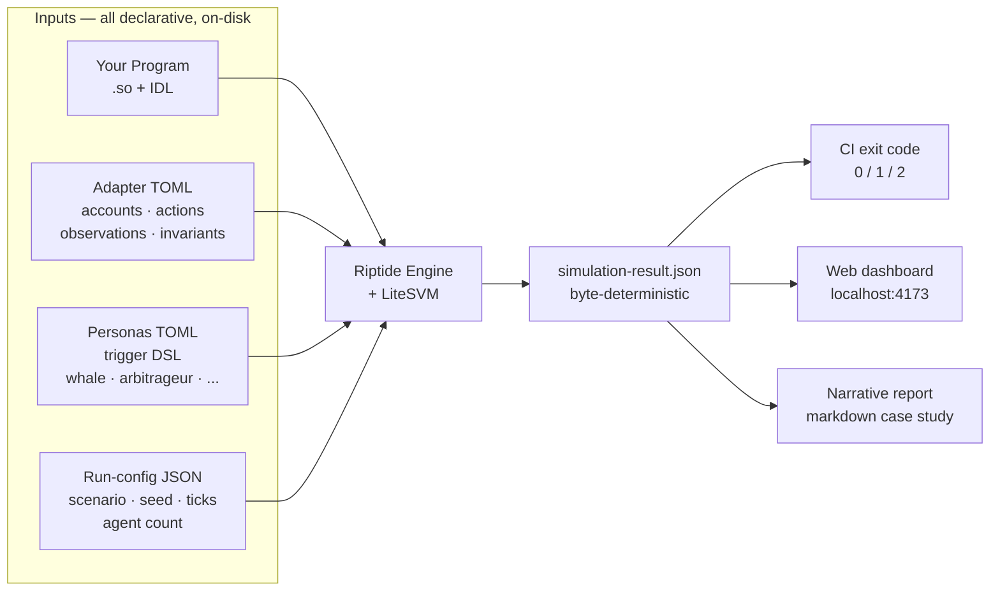

# Riptide

## Overview

**Riptide** is a multi-agent economic simulator for Solana programs. Point it at any on-chain program — a lending pool, a perps exchange, an AMM, a game economy — and Riptide hammers it with a population of adversarial agents while sweeping the parameter space you care about. **Map the failure region of your program before mainnet does.**

Three things Riptide does:

- **Simulate** — runs your real compiled BPF program inside a fast in-process Solana VM (LiteSVM), driven by your actual IDL.
- **Stress-test** — unleashes hundreds of adversarial agents (whales, arbitrageurs, sandwich attackers, liquidators, LPs, rug pullers) across price shocks, oracle trajectories, and parameter sweeps you declare.
- **Gate** — every run is byte-for-byte deterministic from declarative TOML files alone, so the same seed always produces the same sha256 output; every invariant you declare becomes a CI gate (engine exits non-zero when one fires).

### Riptide in 60 seconds

| You give it                                                                          | You get back                                                                                                           |
| ------------------------------------------------------------------------------------ | ---------------------------------------------------------------------------------------------------------------------- |
| A compiled Solana program (`.so`) + IDL                                              | A deterministic parameter-region map showing where your program breaks                                                 |
| An **adapter TOML** wiring accounts, actions, observations, invariants               | Machine-checkable invariant exit codes (`0` = all held, `1` = at least one fired) ready for CI                         |
| A **run-config** (scenario, seed, ticks, agent count)                                | A web dashboard (`localhost:4173`) — run metadata, timeseries, event stream, invariants highlighted                   |
| Optionally: a **persona library** (shipping TOMLs ready to use, or hand-author yours)| A narrative case-study report citing specific ticks and events                                                         |
| *(optional)* a declared tx-sequence + oracle-trajectory JSON                         | A byte-stable replay of that trajectory against the same adapter, with declared invariants evaluated every tick        |
| *(optional)* `riptide init` in your Anchor repo                                      | A ready-to-fill `.riptide/` tree — adapter stub, starter personas, baseline scenario, version-control it with your program |

### Why LiteSVM?

Solana devs know `solana-test-validator` and Bankrun. Riptide runs on **LiteSVM** — an in-process Solana VM that executes the same BPF bytecode as mainnet without the RPC / gossip / consensus overhead. For a `100-agent × 180-tick` lending workload, LiteSVM finishes in **~0.9 seconds**; `solana-test-validator` takes **~15 minutes** for the same workload (measured 2026-04-12). That gap is what makes agent-scale simulation viable: Riptide drives **[1000 agents for 30 ticks in under 5 seconds](docs/benchmarks/agent-scaling.md)** on a standard laptop, byte-deterministic across reruns. When validator-level parity actually matters (gossip, vote, PoH), the `solana-test-validator` path stays available as a diagnostic — see [`docs/architecture.md`](docs/architecture.md).

### Our Vision

Riptide aims to make economic safety a machine-checkable question instead of a theoretical argument. Every Solana protocol lives somewhere in a space of parameter choices × user behaviors × market conditions; bugs are points, economic failures are neighborhoods. You don't find a neighborhood by checking one point — you sweep the region and watch where invariants break.

- **For protocol teams:** a rehearsal ground for launch parameters — pick from a regime you have deterministic evidence for, not gut feel.
- **For auditors and security researchers:** a reproducible artifact — when you claim a failure mode exists, the adapter TOML + run-config is the whole claim. A reviewer reruns it on their machine and the same bytes come out.

From pre-launch stress tests to trajectory replays to game-economy sandboxes, Riptide makes *"what happens if..."* a question with a byte-stable answer. It is a lab for exploring the parameter space around your program — not an oracle for predicting mainnet outcomes.

## Screenshots


*The web dashboard at `localhost:4173` after a `riptide run --serve` completes. Run metadata, summary metrics, a tick-by-tick timeseries, the full event stream (filterable by action / outcome / agent), and invariant firings highlighted in red.*

Terminal output when running the same cell:

```
$ riptide run solend-fork/hero-grid/w25-s40 --serve
riptide run: 1 scenario
TICK 1/20
... (engine tick progress elided)
TICK 20/20
ok solend-fork/hero-grid/w25-s40  (0.1s, 0 invariant fires)

1 pass · 0 fail · 0 skip
Dashboard: http://localhost:4173

exit 0
```

The full-path form `riptide run fixtures/scenarios/solend-fork/hero-grid/w25-s40/run-config.json` still works (backward-compat for scripts and CI); the short form above is the default once `.riptide/scenarios/` is populated — which it is inside this monorepo via a `fixtures/scenarios/` symlink, and in any user repo via `riptide init`.

The hero grid sweeps the `whale-share × shock-magnitude` parameter region and records each cell's `cumulative_bad_debt` in its `simulation-result.json`; the grid's value is the *region map* — which cells end up inside the bad-debt neighborhood and which don't. Invariant-driven CI gating is a separate mode: declare `[[invariants]]` on your own adapter (like the shipping replay adapter does for `no_bad_debt` — `fixtures/replays/solend-nov-2022/adapter.toml`) and the engine exits `1` the moment any invariant fires, so the same `riptide run` output pattern doubles as a CI gate.

## Use Cases

- **Pre-launch stress testing** — map the parameter neighborhood where your protocol breaks before mainnet does; ship with a grid attached to the design doc.
- **Trajectory replay** — declare a tx-sequence + oracle-trajectory against the same adapter your synthetic sweeps use, and Riptide replays it byte-stably tick-by-tick with invariants evaluated every tick (the Solend June 2022 whale-risk incident ships as a reference replay — a trajectory declared on disk, not a claim about mainnet state).
- **Launch parameter selection** — run safe-vs-risky side-by-side comparisons to pick launch parameters with deterministic evidence instead of gut feel.
- **CI integration** — declare invariants inline in your adapter; the engine exits 1 the moment any invariant fires, so your pipeline blocks on economic regressions the same way it blocks on test regressions.
- **Post-audit verification** — bound an auditor's theoretical concern with a Riptide grid to see whether it actually manifests under the parameter regimes you chose.
- **Game economy design** — the generic primitive runs *any* Solana program end-to-end, not just DeFi. Token flows, crafting loops, auction dynamics — anything with shared state under pressure is simulatable.
- **Protocol research** — compare failure-mode profiles across different designs of the same primitive class (alternative LP reward schemes, alternative liquidation formulas, alternative perps funding-rate models).

## Workflow



1. **Protocol Modeling** — Write an **adapter TOML** (Riptide's wiring file: declares your program's accounts, actions, observations, and invariants in plain TOML). Wire an oracle if your program needs one — admin-mock for testing, Pyth-layout for drop-in compatibility with real Pyth consumers. Declare the invariants that matter (machine-checkable properties that double as CI gates). Curate a persona library (reusable adversarial archetypes per protocol class).
2. **Scenario Generation** — Match your adapter's shape against the **failure-mode taxonomy** (a catalog of named failure categories like `whale_concentration`, `liquidation_cascade`, `price_manipulation_via_swap` — curated from real DeFi incidents). Propose parameter sweeps — 1D or 2D grids where every cell is a complete bootable sub-scenario. Assign adversarial personas from the library.
3. **Deterministic Simulation** — LiteSVM executes your real BPF program tick-by-tick. Personas fire instructions based on trigger conditions (`observation.utilization > 0.9 → withdraw_all`). Invariants evaluate every tick. Same seed → same sha256, always; enforced by a regression test.
4. **Discovery & Reporting** — A mechanical report (metrics, events, invariant firings, summary) lands on disk as JSON. A narrative report (LLM cites specific ticks and event types, reads like a case study) lands as markdown. The web dashboard at `localhost:4173` renders everything visually with invariant firings highlighted red.
5. **Trajectory Replay** — Declare a tx-sequence + oracle-trajectory against the same adapter your synthetic sweeps use (the Solend June 2022 whale-risk incident ships as a reference replay). Riptide runs that declared trajectory deterministically tick-by-tick, and asserts your declared invariants fire at the declared ticks. The replay is a byte-stable run of what you declared — not a forensic reconstruction of what happened on-chain.

> **Claude Code skills are optional accelerators, not requirements.** The `riptide-adapt`, `riptide-scenarios`, and `riptide-narrative` skills let a session-native LLM do first passes on adapter generation, scenario proposal, and report writing — typing them into any Claude Code session beats manual authoring on speed. You can hand-author every artifact instead: adapter TOML, persona TOMLs, scenarios, and run-configs are plain files you edit directly. The engine doesn't require any skill to run; the skills exist because most devs want faster starting points.

### What an adapter looks like

<details>
<summary>Click to expand — a minimal ~40-line adapter, authentic syntax from the shipping AMM bundle</summary>

```toml
# .riptide/adapters/my-liquid-staking.toml
#
# Wires your Solana program into Riptide. The only file you usually
# need to hand-author — personas, scenarios, and invariants all
# reference what you declare here.

protocol   = "generic"
program_so = "target/deploy/my_liquid_staking.so"
idl_path   = "target/idl/my_liquid_staking.json"

# Accounts the program reads and writes.
# "shared" = one instance for all agents (like a staking pool).
# "agent"  = one instance per agent (like a user's position).
[accounts.pool]
kind  = "shared"
space = 200

[accounts.user_position]
kind  = "agent"
space = 80

# Instructions personas can fire. `amount` is runtime-bound
# (the persona picks a value per-tick).
[instructions.stake]
action = "stake"
amount = "sol_amount"

[instructions.unstake]
action = "unstake"
amount = "token_amount"

# Observations exposed to personas + invariants. Any field of a
# declared account can be observed.
[observations]
"pool.total_staked"  = "uint"
"pool.liquid_supply" = "uint"
"pool.exchange_rate" = "uint"

# Invariants — engine exits non-zero if any fire during the run.
[[invariants]]
name  = "liquid_supply_bounded"
field = "pool.liquid_supply"
op    = "<="
value = 10000000000000

[[invariants]]
name  = "exchange_rate_bounded"
field = "pool.exchange_rate"
op    = "<="
value = 10000000000
```

That's it for the adapter — the rest of the six-layer stack (personas, scenarios, parameters, taxonomy) lives in separate files or skill prompts that reference these declarations. See [`docs/architecture.md`](docs/architecture.md) for the full mental model, and [`fixtures/adapters/`](fixtures/adapters/) in the repo for shipping examples against real programs (lending, perps, AMM, and a non-DeFi toy).

</details>

## Quick Install

```bash
git clone https://github.com/riptidesim/riptide
cd riptide
./install.sh
```

Linux is the supported path (macOS / Windows are out of scope — see [`docs/install.md`](docs/install.md)). Requires Rust, Node, and `cargo-build-sbf` on your `$PATH` — the installer checks and prints install hints if anything is missing.

Once `riptide` is on your `$PATH`, the canonical first run is a drop-in: `riptide init` scaffolds a `.riptide/` working directory inside any Anchor repo, you fill in one stub adapter, and `riptide run` discovers every scenario you author and prints a jest-style pass/fail summary.

```bash
cd ~/path/to/your-anchor-program
riptide init
# edit .riptide/adapters/<program-name>.toml to match your program
riptide run --serve
```

The `.riptide/` tree holds your adapter, persona library, and scenarios — version-control them alongside your program. `riptide run` with no arguments discovers every `.riptide/scenarios/**/run-config.json` and runs it sequentially; pass a glob pattern to filter, or an explicit `.json` path to run a single file. See [`docs/install.md`](docs/install.md#next-steps-after-install) for the full first-run walkthrough.

For running the shipping bundles in a cloned monorepo (lending, perps, AMM, plus the Solend Nov 2022 replay), point `riptide run` at a shipping fixture path directly:

```bash
# Secondary path — for contributors working against the repo's own fixtures
riptide run fixtures/scenarios/solend-fork/hero-grid/w25-s40/run-config.json --serve
```

Prefer a container? The repo ships a multi-stage `Dockerfile` pinned to the full [`TOOLCHAIN.md`](TOOLCHAIN.md) stack:

```bash
docker build -t riptide .
docker run --rm riptide run fixtures/scenarios/solend-fork/hero-grid/w25-s40/run-config.json
```

> **Public distribution (GHCR `ghcr.io/riptidesim/riptide`, crates.io `riptide-engine`, npm `@riptide/cli`) is wired up and dry-run-verified in the repo but has not been published yet.** Until then, use the build-from-source or local-Docker paths above.

## Getting Started

```bash
riptide init                             # Scaffold .riptide/ in the current repo (adapter stub + personas + baseline scenario)
riptide list                             # List every discovered scenario under .riptide/scenarios/
riptide run                              # Discover + run every scenario in .riptide/scenarios/ (jest-style summary)
riptide run <pattern>                    # Filter discovered scenarios by glob (e.g. '*w25*', 'hero-grid/*')
riptide run <run-config.json>            # Run a single run-config file directly (backward-compat)
riptide run --only-failing               # Rerun only scenarios that failed or aborted last time
riptide run --serve                      # After the sweep, start the dashboard on localhost:4173
riptide replay <replay-config>           # Replay a historical on-chain trajectory
riptide adapt --adapter <toml>           # Smoke-test an adapter TOML end-to-end
riptide simulate <config>                # Legacy explicit-flag path — see docs/architecture.md
```

Exit codes follow a jest-style contract: `0` every scenario passed, `1` one or more invariants fired, `2` setup error (discovery missing, adapter not found, engine binary absent), `3` internal partial abort, `130` SIGINT. CI wrappers can gate merges on economic regressions without extra shell logic.

For the shipping hero-grid `w25-s40` cell (mainnet-adjacent Solend fork, produces bad debt under whale concentration):

```bash
riptide run fixtures/scenarios/solend-fork/hero-grid/w25-s40/run-config.json --serve
```

For the historical replay path:

```bash
riptide replay fixtures/replays/solend-nov-2022/config.json --serve
```

📖 **[Full documentation →](docs/README.md)**

## Documentation

All documentation lives under [`docs/`](docs/):

| Section | What's Covered |
|---------|----------------|
| [Vision](docs/vision.md) | Why Riptide exists, the lab-not-oracle stance, what's explicitly *not* in scope, adversarial-review posture |
| [Architecture](docs/architecture.md) | The six-layer stack, LiteSVM runtime + validator-parity diagnostic path, determinism model, adapter pipeline from TOML to engine |
| [Install](docs/install.md) | `install.sh` one-command path, Docker, from-source recipe, upgrade path, toolchain pins |
| [Case study: Solend-fork](docs/case-studies/solend-fork.md) | The 3×3 whale × shock hero grid — the shipping outcome demo and the load-bearing claim |
| [Benchmark: Agent scaling](docs/benchmarks/agent-scaling.md) | 1000 agents for 30 ticks in under 5 seconds on a standard laptop, ~55 MB RAM, byte-deterministic |
| [Toolchain pins](TOOLCHAIN.md) | Exact Rust, Solana CLI, `cargo-build-sbf`, platform-tools, and Node versions the engine and programs build against |
| [Contributing](CONTRIBUTING.md) | Decision tree for adapter vs persona vs taxonomy vs engine, dev setup, project structure, regression gates, PR process |

## License

Riptide is dual-licensed under **MIT OR Apache-2.0** at your option. See [`LICENSE`](LICENSE).

## Contributing

See [`CONTRIBUTING.md`](CONTRIBUTING.md) for how to add a new adapter, persona, failure-mode taxonomy category, or skill — plus the dev setup, project structure, determinism discipline, and PR process.
