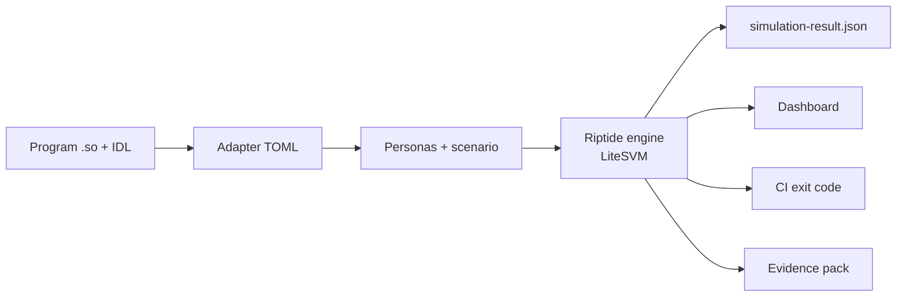

# Riptide

<p align="center">
  
</p>

<p align="center">
  <a href="TOOLCHAIN.md"></a>
  <a href="cli/package.json"></a>
  <a href="TOOLCHAIN.md"></a>
  <a href="docs/architecture.md"></a>
</p>

**Deterministic multi-agent simulation for Solana programs.**

Riptide runs your compiled Solana program in LiteSVM, drives it with declared agent behavior, and shows where your protocol starts losing economic headroom. Use it to map parameter regions, replay declared trajectories, and turn invariants into CI gates before mainnet does the experiment for you.

[Get started](#get-started) • [How it works](#how-it-works) • [Run your program](#run-your-program) • [Campaign Runner](#campaign-runner) • [Evidence packs](#evidence-packs) • [Docs](#docs)


> [!IMPORTANT]
> Riptide produces simulation evidence, not audit signoff. A failing cell is a reproducible point in a declared experiment; your team still decides whether that point matters.

## Why Riptide

Solana protocols do not fail at one tidy input. They fail across regions: whale concentration, oracle movement, liquidation capacity, leverage, queue depth, pool imbalance, or user behavior all interacting at once.

Riptide is built for that shape of question:

| You want to know... | Riptide gives you... |
| --- | --- |
| Where does this parameter set break? | Deterministic sweeps across personas, shocks, ticks, and agent counts. |
| Can this incident shape happen again? | Declared replays with initial state, transactions, oracle paths, and invariants. |
| Can CI catch economic regressions? | Exit code `1` when declared invariants fire. |
| Can a reviewer rerun the claim? | Evidence packs with manifests, traces, rerun scripts, and canonical hashes. |

## How It Works



Riptide keeps the load-bearing pieces on disk:

- **Adapter TOML** wires your program, accounts, instructions, observations, oracle bindings, lineage, and invariants.
- **Personas** describe deterministic agent behavior such as whales, liquidators, LPs, arbitrageurs, redeemers, or custom game-economy actors.
- **Scenarios** define the experiment: seeds, ticks, agent counts, price shocks, scheduled actions, or replay trajectories.
- **LiteSVM execution** runs the real BPF program in-process, fast enough for sweeps while staying byte-stable for committed inputs.
- **Artifacts** include JSON results, markdown summaries, dashboard data, and reviewer-ready packs.

Shipping bundles cover lending, perpetuals, AMMs, liquid staking, stablecoins, and a non-DeFi `resource-grinder` example. The same adapter surface is meant for your own Anchor program.

## Get Started

Use the hosted installer for the shortest path. It downloads a prebuilt bundle
for Linux x86_64, macOS Intel/Apple Silicon, or Windows x64.

```bash
# Install on Linux or macOS:
curl -fsSL https://riptide.run/install | sh
```

```powershell
# Install on Windows PowerShell:
irm https://riptide.run/install.ps1 | iex
```

```bash
# Build from repository when developing Riptide itself:
git clone https://github.com/riptidesim/riptide
cd riptide
./install.sh
```

The hosted installer does not require Rust, Node.js, npm, Solana CLI, or
`cargo-build-sbf`. The repository installer builds the Rust engine, TypeScript
CLI, shipped SBF programs used by the smoke tests, and a `riptide` launcher
under `$HOME/.local/bin`.

```bash
riptide doctor
```

Prefer Docker from a clean checkout:

```bash
docker build -t riptide .
docker run --rm riptide doctor
```

> [!NOTE]
> The hosted installer expects matching GitHub Release assets for the requested
> version. If you are testing unreleased changes, use `./install.sh` from a
> checkout or the local Docker build. See [Install](docs/install.md) for the
> full setup and upgrade path.

## Wire Your Program

Inside your own Anchor repo:

```bash
riptide init
/riptide-config
riptide campaign run .riptide/campaigns/<risk>.campaign.toml
riptide review <campaign-root>
```

Plain `riptide init` is a minimal bootstrap. It writes one adapter
placeholder with detected `program_so` / `idl_path` hints when possible,
plus `.riptide/GETTING-STARTED.md`. It does not choose personas,
scenarios, invariants, seeds, agents, or ticks.

`/riptide-config` is the default configuration step. It repairs the
adapter, adds a harness when custom account bytes or sibling programs
are needed, creates personas, scenarios, invariants, prepares campaign
readiness by writing and validating a Campaign TOML, and reports the
exact run/review commands.

Use `--profile <profile>` or `--protocol <protocol>` only as an adapter
hint for the thin scaffold, or as defaults for `riptide init --wizard`.
The wizard is the advanced manual path for users who want to choose
personas, scenarios, invariants, seeds, agents, and ticks themselves.

> [!TIP]
> Riptide runs plain files, not session state. Everything `/riptide-config` creates is TOML, Rust, JSON, or markdown you can review and edit.

## Run Your Program

After `/riptide-config` reports readiness, list the scenarios Riptide found:

```bash
riptide list
```

Run one scenario as a one-seed smoke:

```bash
riptide run baseline --adapter .riptide/adapters/<program-name>.toml --seeds 1 --seed-root 1337
```

Run your full local scenario set and open the dashboard:

```bash
riptide run --adapter .riptide/adapters/<program-name>.toml --serve
```

Replay one of your declared trajectories:

```bash
riptide replay .riptide/replays/<case>/config.json \
  --allow-invariant-violations
```

Review one of your evidence packs without rerunning the engine:

```bash
riptide review .riptide/pack/<run-id>/
```

Common commands:

| Command | Purpose |
| --- | --- |
| `riptide doctor` | Static environment and adapter health check. |
| `riptide init` | Create the thin `.riptide/` bootstrap: adapter placeholder and getting-started guide. |
| `/riptide-config` | Default setup path: adapter, harness, personas, scenarios, invariants, campaign readiness, validation, and next commands. |
| `riptide harness generate` | Generate a Rust setup crate for protocol-owned accounts/programs. |
| `riptide list` | List discovered scenarios under `.riptide/scenarios/`. |
| `riptide run [pattern-or-path]` | Run all scenarios, a glob-filtered set, or one JSON run config. Add `--harness` when custom setup is needed. |
| `riptide replay <config>` | Replay a declared trajectory. |
| `riptide explain <adapter>` | Pretty-print a parsed adapter: protocol, runtime, accounts, instructions, observations, personas, invariants, semantics, and oracles. |
| `riptide lint <adapter>` | Validate a JSON-IDL-backed adapter. |
| `riptide lineage <adapter>` | Print adapter provenance and assumptions. |
| `riptide review <pack>` | Validate an evidence pack and emit reviewer markdown. |

Exit codes are CI-friendly: `0` all pass, `1` invariant fired, `2` setup error, `3` partial abort, `130` interrupted.

## Campaign Runner

Campaign Runner turns one Campaign TOML into a deterministic sweep of
your scenario families, sampled parameters, retained cases, and
reviewer-ready summaries. Use it when one smoke run is too quiet and you
need to show the shape of a risk frontier across seeds and parameters.

After `/riptide-config` creates or repairs a campaign TOML, run:

```bash
riptide campaign validate .riptide/campaigns/<risk>.campaign.toml
riptide campaign plan .riptide/campaigns/<risk>.campaign.toml
riptide campaign run .riptide/campaigns/<risk>.campaign.toml
riptide review <campaign-root>
```

The `campaign run` output prints the campaign root to review. The root
contains `campaign-summary.md`, `campaign-summary.json`, `runs.jsonl`,
`parameters.csv`, `retention-manifest.json`, and retained case
directories. See [Campaign Runner](docs/campaigns.md) for a repo-local
Campaign TOML template, artifact map, trust boundary, and
troubleshooting.

## Evidence Packs

Every `riptide run` and `riptide replay` emits `.riptide/pack/<run-id>/`:

```text
.riptide/pack/<run-id>/
├── manifest.json
├── summary.md
├── trace.md
├── rerun.sh
├── inputs/paths.json
└── outputs/paths.json
```

The pack is designed for handoff: repo-relative paths only, canonical hashes, parseable rerun scripts, declared invariant firings, and enough context for a reviewer to validate what was run without inheriting your terminal session.

Read [Evidence packs](docs/pack.md) and [CI handoff](docs/ci-handoff.md) for the reviewer workflow.

## Project Map

| Path | What lives there |
| --- | --- |
| [`engine/`](engine/) | Rust engine and LiteSVM runtime. |
| [`cli/`](cli/) | Node.js CLI, dashboard server, adapter linting, orchestration. |
| [`fixtures/adapters/`](fixtures/adapters/) | Shipping adapter TOMLs. |
| [`fixtures/personas/`](fixtures/personas/) | Monorepo fixture persona libraries. Configured user repos keep personas inline in adapter `[personas.*]` tables. |
| [`fixtures/scenarios/`](fixtures/scenarios/) | Monorepo fixture scenario bundles (`run-config.json`, and when needed fixture `policies.json` / `manifest.json`). User repos use `.riptide/scenarios/**/run-config.json`. |
| [`fixtures/replays/`](fixtures/replays/) | Declared replay artifacts and committed packs. |
| [`programs/`](programs/) | Minimal Solana programs used by the examples. |
| [`docs/`](docs/) | Architecture, install, handoff, lineage, and case-study docs. |
| [`skills/`](skills/) | Codex/Claude Code skills, including the default `/riptide-config` setup flow and narrative authoring. |

## Docs

| Start here | When you need... |
| --- | --- |
| [Install](docs/install.md) | Supported setup, Docker, repository build commands, and upgrades. |
| [Campaign Runner](docs/campaigns.md) | Validate, plan, run, and review deterministic campaign sweeps. |
| [Architecture](docs/architecture.md) | The six-layer model, LiteSVM caveats, determinism, and adapter pipeline. |
| [Vision](docs/vision.md) | The lab-not-oracle stance and what Riptide explicitly does not claim. |
| [Case-study corpus readiness](docs/case-study-corpus.md) | External case-study matrix, executed evidence, claim boundaries, and next actions. |
| [Solend-fork case study](docs/case-studies/lending.md) | The whale-share × shock grid and the load-bearing example. |
| [Evidence packs](docs/pack.md) | Pack shape, canonical hashes, and rerun workflow. |
| [CI handoff](docs/ci-handoff.md) | How to pin a replay proof in GitHub Actions. |
| [Adapter lineage](docs/adapter-lineage.md) | Adapter provenance, assumptions, and JSON IDL linting. |
| [Toolchain](TOOLCHAIN.md) | Exact Rust, Node, Solana CLI, and SBF versions. |
