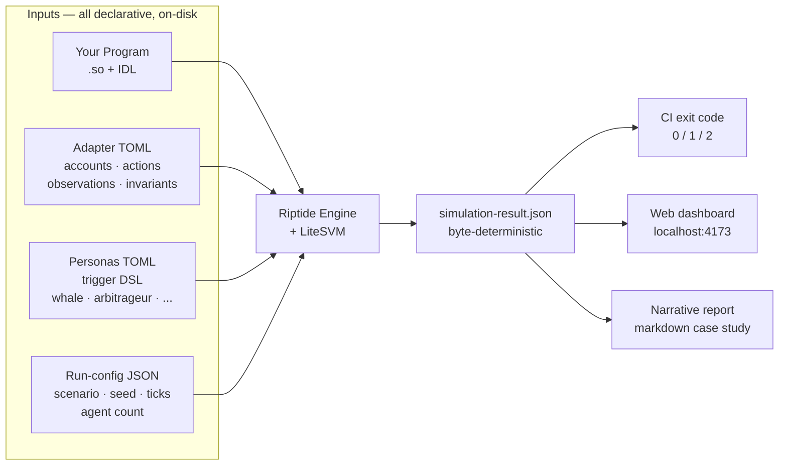

# Riptide

## Overview

**Riptide** is a multi-agent economic simulator for Solana programs. Point it at any on-chain program — a lending pool, a perps exchange, an AMM, a game economy — and Riptide hammers it with a population of adversarial agents while sweeping the parameter space you care about. **Map the failure region of your program before mainnet does.**

Three things Riptide does:

- **Simulate** — runs your real compiled BPF program inside a fast in-process Solana VM (LiteSVM), driven by your actual IDL.
- **Stress-test** — unleashes hundreds of adversarial agents (whales, arbitrageurs, sandwich attackers, liquidators, LPs, rug pullers) across price shocks, oracle trajectories, and parameter sweeps you declare.
- **Gate** — every run is byte-for-byte deterministic from declarative TOML files alone, so the same seed always produces the same sha256 output; every invariant you declare becomes a CI gate (engine exits non-zero when one fires).

### Riptide in 60 seconds

| You give it                                                                          | You get back                                                                                                           |
| ------------------------------------------------------------------------------------ | ---------------------------------------------------------------------------------------------------------------------- |
| A compiled Solana program (`.so`) + IDL                                              | A deterministic parameter-region map showing where your program breaks                                                 |
| An **adapter TOML** wiring accounts, actions, observations, invariants               | Machine-checkable invariant exit codes (`0` = all held, `1` = at least one fired) ready for CI                         |
| A **run-config** (scenario, seed, ticks, agent count)                                | A web dashboard (`localhost:4173`) — run collection review, verdicts, coverage checks, metrics, events, invariants    |
| Optionally: a **persona library** (shipping TOMLs ready to use, or hand-author yours)| A narrative case-study report citing specific ticks and events                                                         |
| *(optional)* a declared tx-sequence + oracle-trajectory JSON                         | A byte-stable replay of that trajectory against the same adapter, with declared invariants evaluated every tick        |
| *(optional)* `riptide init` in your Anchor repo                                      | A ready-to-fill `.riptide/` tree — adapter stub, starter personas, baseline scenario, version-control it with your program |

### Why LiteSVM?

Solana devs know `solana-test-validator` and Bankrun. Riptide runs on **LiteSVM** — an in-process Solana VM that executes the same BPF bytecode as mainnet without the RPC / gossip / consensus overhead. For a `100-agent × 180-tick` lending workload, LiteSVM finishes in **~0.9 seconds**; `solana-test-validator` takes **~15 minutes** for the same workload (measured 2026-04-12). That gap is what makes agent-scale simulation viable: Riptide drives **[1000 agents for 30 ticks in under 5 seconds](docs/benchmarks/agent-scaling.md)** on a standard laptop, byte-deterministic across reruns. When validator-level parity actually matters (gossip, vote, PoH), the `solana-test-validator` path stays available as a diagnostic — see [`docs/architecture.md`](docs/architecture.md).

### Our Vision

Riptide aims to make economic safety a machine-checkable question instead of a theoretical argument. Every Solana protocol lives somewhere in a space of parameter choices × user behaviors × market conditions; bugs are points, economic failures are neighborhoods. You don't find a neighborhood by checking one point — you sweep the region and watch where invariants break.

- **For protocol teams:** a rehearsal ground for launch parameters — pick from a regime you have deterministic evidence for, not gut feel.
- **For auditors and security researchers:** a reproducible artifact — when you claim a failure mode exists, the adapter TOML + run-config is the whole claim. A reviewer reruns it on their machine and the same bytes come out.

From pre-launch stress tests to trajectory replays to game-economy sandboxes, Riptide makes *"what happens if..."* a question with a byte-stable answer. It is a lab for exploring the parameter space around your program — not an oracle for predicting mainnet outcomes.

## Screenshots


*The web dashboard at `localhost:4173` after a `riptide run --serve` completes. The top of the page reviews the run collection: status totals, verdict totals, coverage totals, scenario picker, filters, and an interpretation panel before the selected scenario's metadata, metrics, timeseries, events, and invariant rows.*

Terminal output when running the same cell:

```
$ riptide run lending/hero-grid/w25-s40 --serve
riptide run: 1 scenario
ok lending/hero-grid/w25-s40  (0.1s, no failure observed, confidence: medium, coverage: exercised)

1 pass · 0 fail · 0 error · 0 skip
verdicts: 1 no-failure-observed

Dashboard: http://127.0.0.1:4173
Run collection: /path/to/riptide/.riptide/run-collection.json
```

The full-path form `riptide run fixtures/scenarios/lending/hero-grid/w25-s40/run-config.json` still works (backward-compat for scripts and CI); the short form above is the default once `.riptide/scenarios/` is populated — which it is inside this monorepo via a `fixtures/scenarios/` symlink, and in any user repo via `riptide init`.

The hero grid sweeps the `whale-share × shock-magnitude` parameter region and records each cell's `cumulative_bad_debt` in its `simulation-result.json`; the grid's value is the *region map* — which cells end up inside the bad-debt neighborhood and which don't. Invariant-driven CI gating is a separate mode: declare `[[invariants]]` on your own adapter (like the shipping replay adapter does for `no_bad_debt` — `fixtures/replays/lending-whale-bad-debt/adapter.toml`) and the engine exits `1` the moment any invariant fires, so the same `riptide run` output pattern doubles as a CI gate.

## Use Cases

- **Pre-launch stress testing** — map the parameter neighborhood where your protocol breaks before mainnet does; ship with a grid attached to the design doc.
- **Trajectory replay** — declare a tx-sequence + oracle-trajectory against the same adapter your synthetic sweeps use, and Riptide replays it byte-stably tick-by-tick with invariants evaluated every tick (a whale-concentrated-borrow bad-debt replay — historical inspiration: the Solend June 2022 whale-risk incident — ships as a reference replay, a trajectory declared on disk, not a claim about mainnet state).
- **Launch parameter selection** — run low-stress vs high-stress side-by-side comparisons to pick launch parameters with deterministic evidence instead of gut feel.
- **CI integration** — declare invariants inline in your adapter; the engine exits 1 the moment any invariant fires, so your pipeline blocks on economic regressions the same way it blocks on test regressions.
- **Post-audit verification** — bound an auditor's theoretical concern with a Riptide grid to see whether it actually manifests under the parameter regimes you chose.
- **Game economy design** — the generic primitive runs *any* Solana program end-to-end, not just DeFi. Token flows, crafting loops, auction dynamics — anything with shared state under pressure is simulatable.
- **Protocol research** — compare failure-mode profiles across different designs of the same primitive class (alternative LP reward schemes, alternative liquidation formulas, alternative perps funding-rate models).

## Workflow



The workflow follows a five-step accurate pattern:

1. **Wire the program.** Author an **adapter TOML** that declares the program's `.so`, IDL, accounts, instructions, observations, oracle bindings, and invariants. Oracle binding picks one of the supported kinds — admin-mock for testing, Pyth-layout for drop-in Pyth consumers. Invariants are machine-checkable properties that double as CI gates. Lineage metadata records where the adapter came from (JSON IDL, hand-authored, inferred assumptions).
2. **Define actors.** Author **personas / policies** under `fixtures/personas/<adapter>/*.toml` (or `.riptide/personas/`) — borrower / liquidator / LP / arbitrageur / redeemer behaviour, declared as deterministic policies over observations.
3. **Declare a scenario or replay.** For synthetic stress, write a **run config** + scenario parameters: seed, ticks, agent counts, shock paths. For replay, swap the synthetic shock surface for explicit `initial-state.json`, `trajectory.json`, and `oracle-trajectory.json` files; an optional **replay-scoped adapter override** is supported when the recorded program shape diverges from the one your repo currently builds.
4. **Run deterministically.** LiteSVM executes the real BPF program tick-by-tick. Personas fire instructions based on declared trigger conditions (`observation.utilization > 0.9 → withdraw_all`). Invariants evaluate every tick. Same committed inputs → same sha256, enforced by a regression test.
5. **Inspect evidence.** Each run emits a mechanical report (JSON), a narrative report (markdown), `.riptide/run-collection.json` with status / verdict / coverage totals, and a reviewer-ready evidence pack with manifest, summary, trace, rerun script, and a canonical hash. The web dashboard at `localhost:4173` reviews that collection and drills into each scenario.

> **Trajectory replay note.** The shipping `lending-whale-bad-debt` replay is a declared trajectory against the existing Solend-shaped lending primitive — historical inspiration: the Solend June 2022 whale-risk episode. It is a byte-stable run of what you declared on disk, not a byte-level mainnet reconstruction.

> **Coming next — economic semantics.** Today you bind raw fields and write invariants over them. The next milestone is a declarative `[semantics]` block inside the adapter that maps raw fields to protocol-class concepts — collateral value, debt, health, redemption pressure, margin — under versioned classes (`lending.v1`, `perps-margin.v1`, `amm.v1`, `lst.v1`, `stablecoin.v1`) with named roles, derived observations, expression invariants, and protocol-specific extensions. Once it lands, integrating a new protocol becomes mappings + extensions on the standard stress catalog instead of authoring a new simulator. The design contract is committed at `.specs/designs/economic-semantics-v1.md`; **status: design committed, implementation in flight Sprint 19+**. Semantics complements adapter lineage; it does not replace it.

> **Claude Code skills are optional accelerators, not requirements.** The `riptide-adapt`, `riptide-scenarios`, and `riptide-narrative` skills let a session-native LLM do first passes on adapter generation, scenario proposal, and report writing — typing them into any Claude Code session beats manual authoring on speed. You can hand-author every artifact instead: adapter TOML, persona TOMLs, scenarios, and run-configs are plain files you edit directly. The engine doesn't require any skill to run; the skills exist because most devs want faster starting points.

### What an adapter looks like

<details>
<summary>Click to expand — a minimal ~40-line adapter, authentic syntax from the shipping AMM bundle</summary>

```toml
# .riptide/adapters/my-liquid-staking.toml
#
# Wires your Solana program into Riptide. The only file you usually
# need to hand-author — personas, scenarios, and invariants all
# reference what you declare here.

# Paths below are resolved relative to this file's parent directory,
# so from `.riptide/adapters/` two dot-dot segments reach the
# Anchor repo's top-level `target/` tree.
protocol   = "generic"
program_so = "../../target/deploy/my_liquid_staking.so"
idl_path   = "../../target/idl/my_liquid_staking.json"

# Accounts the program reads and writes.
# "shared" = one instance for all agents (like a staking pool).
# "agent"  = one instance per agent (like a user's position).
[accounts.pool]
kind  = "shared"
space = 200

[accounts.user_position]
kind  = "agent"
space = 80

# Shared accounts can optionally declare an external owner — a
# sibling program's compiled .so (owner derived from the
# local target/deploy/<name>-keypair.json) or a literal base58
# pubkey for a real external program such as Pyth. Omit `owner`
# and the simulated program owns the account, which is what
# every non-oracle shared account wants.
[accounts.price_feed]
kind  = "shared"
space = 50
owner = { program_so = "../../target/deploy/admin_mock_oracle.so" }

# Instructions personas can fire. `amount` is runtime-bound
# (the persona picks a value per-tick).
[instructions.stake]
action = "stake"
amount = "sol_amount"

[instructions.unstake]
action = "unstake"
amount = "token_amount"

# Observations exposed to personas + invariants. Any field of a
# declared account can be observed.
[observations]
"pool.total_staked"  = "uint"
"pool.liquid_supply" = "uint"
"pool.exchange_rate" = "uint"

# Invariants — engine exits non-zero if any fire during the run.
[[invariants]]
name  = "liquid_supply_bounded"
field = "pool.liquid_supply"
op    = "<="
value = 10000000000000

[[invariants]]
name  = "exchange_rate_bounded"
field = "pool.exchange_rate"
op    = "<="
value = 10000000000

# One bound oracle per generic adapter. `account` must name a
# declared shared account; the harness bootstraps that account
# at tick 0 with real admin-mock or Pyth bytes and mutates it on
# every scenario/replay oracle update. Declare 2+ oracles and the
# loader fails fast — multi-oracle generic semantics are still a
# follow-up.
[[oracles]]
name       = "price_feed"
kind       = "admin-mock"   # or "pyth" for real Pyth layout bytes
account    = "price_feed"
base_price = 100.0
exponent   = 0
```

That's it for the adapter — the rest of the six-layer stack (personas, scenarios, parameters, taxonomy) lives in separate files or skill prompts that reference these declarations. See [`docs/architecture.md`](docs/architecture.md) for the full mental model, and [`fixtures/adapters/`](fixtures/adapters/) in the repo for shipping examples against real programs (lending, perps, AMM, liquid staking, stablecoin, and a non-DeFi toy).

</details>

## Quick Install

```bash
git clone https://github.com/riptidesim/riptide
cd riptide
./install.sh
```

Linux is the supported path (macOS / Windows are out of scope — see [`docs/install.md`](docs/install.md)). Requires Rust, Node, and `cargo-build-sbf` on your `$PATH` — the installer checks and prints install hints if anything is missing.

Once `riptide` is on your `$PATH`, the canonical first run is `install → doctor → init → lint → adapt → run`. `riptide doctor` confirms your toolchain + engine binary + any discovered adapters are sane before anything else runs; `riptide init` scaffolds a `.riptide/` working directory inside any Anchor repo, you fill in one stub adapter, `riptide lint` static-checks it against the JSON IDL named in `[lineage].idl_source`, `riptide adapt` smoke-tests it end-to-end against the local engine, and `riptide run` discovers every scenario you author and prints a jest-style pass/fail summary with a run verdict, confidence, and coverage classification for each scenario.

```bash
riptide doctor                                                        # Health check (no build, no network, no sim)
cd ~/path/to/your-anchor-program
riptide init
# edit .riptide/adapters/<program-name>.toml to match your program
riptide lint <program-name>                                           # Static validation — JSON-IDL-backed adapters only; non-JSON sources warn (see docs/adapter-lineage.md)
riptide adapt --adapter .riptide/adapters/<program-name>.toml         # End-to-end smoke against the local engine (lint preflight runs first when JSON IDL lineage is present)
riptide run --serve
```

The `.riptide/` tree holds your adapter, persona library, and scenarios — version-control them alongside your program. `riptide run` with no arguments discovers every `.riptide/scenarios/**/run-config.json` and runs it sequentially; pass a glob pattern to filter, or an explicit `.json` path to run a single file. Each sweep writes `.riptide/run-collection.json` with totals by status, verdict, and coverage, plus per-scenario coverage checks and artifact paths. `--serve` starts a collection-aware dashboard instead of a single-scenario-only view. This is run evidence from simulation, not audit signoff and not a safety verdict. See [`docs/install.md`](docs/install.md#next-steps-after-install) for the full first-run walkthrough.

The same short-form invocation works inside the cloned Riptide monorepo itself — `.riptide/scenarios/` is a symlink to `fixtures/scenarios/` at the repo root, so `riptide run lending/hero-grid/w25-s40 --serve` discovers and runs the shipping hero-grid cell straight from a monorepo checkout. The full-path form (`riptide run fixtures/scenarios/<path>/run-config.json`) still works unchanged for existing CI and scripts.

Prefer a container? The repo ships a multi-stage `Dockerfile` pinned to the full [`TOOLCHAIN.md`](TOOLCHAIN.md) stack:

```bash
docker build -t riptide .
docker run --rm riptide run lending/hero-grid/w25-s40
```

> **Public distribution (GHCR `ghcr.io/riptidesim/riptide`, crates.io `riptide-engine`, npm `@riptide/cli`) is wired up and dry-run-verified in the repo but has not been published yet.** Until then, use the build-from-source or local-Docker paths above.

## Getting Started

```bash
riptide doctor                           # Static health check — toolchain, engine binary, discovered adapters (no build, no network, no sim)
riptide init                             # Scaffold .riptide/ in the current repo (adapter stub + personas + baseline scenario)
riptide list                             # List every discovered scenario under .riptide/scenarios/
riptide run                              # Discover + run every scenario in .riptide/scenarios/ (jest-style summary)
riptide run <pattern>                    # Filter discovered scenarios by glob (e.g. '*w25*', 'hero-grid/*')
riptide run <run-config.json>            # Run a single run-config file directly (backward-compat)
riptide run --only-failing               # Rerun only scenarios that failed or aborted last time
riptide run --serve                      # After the sweep, start the collection dashboard on localhost:4173
riptide replay <replay-config>           # Replay a historical on-chain trajectory
riptide adapt --adapter <toml>           # Smoke-test an adapter TOML end-to-end (runs lint preflight when JSON IDL lineage is present)
riptide lint <adapter>                   # Static adapter validation against a JSON IDL (non-JSON sources warn — see docs/adapter-lineage.md)
riptide lineage <adapter>                # Print an adapter's `[lineage]` block (IDL source, inferred assumptions, unsupported fields)
riptide simulate <config>                # Legacy explicit-flag path — see docs/architecture.md
```

Exit codes follow a jest-style contract: `0` every scenario passed, `1` one or more invariants fired, `2` setup error (discovery missing, adapter not found, engine binary absent), `3` internal partial abort, `130` SIGINT. CI wrappers can gate merges on economic regressions without extra shell logic.

For the shipping hero-grid `w25-s40` cell (mainnet-adjacent Solend fork, with whale-concentration metrics visible in the dashboard):

```bash
riptide run lending/hero-grid/w25-s40 --serve
```

For the historical replay path:

```bash
riptide replay fixtures/replays/lending-whale-bad-debt/config.json --serve
```

For the liquid-staking depeg / withdrawal-run proof artifact (single-program
pressure; historical inspiration: the 2024 Kelp / rsETH depeg — see the
bundle-local
[`fixtures/replays/liquid-staking-depeg-redemption-run/README.md`](fixtures/replays/liquid-staking-depeg-redemption-run/README.md)
for the full write-up, rerun command, and what this proof does and does not
prove):

```bash
riptide replay fixtures/replays/liquid-staking-depeg-redemption-run/config.json \
  --allow-invariant-violations
```

For the first cross-protocol contagion proof — an upstream LST slash drops
the pool exchange rate, a single declared bridge maps that observation
into the downstream lending collateral oracle, and the terminal
liquidation cascade realizes bad debt that would not have landed under the
pre-shock oracle — see the bundle-local
[`fixtures/replays/lst-lending-contagion-proof/README.md`](fixtures/replays/lst-lending-contagion-proof/README.md)
for the bridge description, per-tick trace, executive summary, and honest
scope notes:

```bash
riptide replay fixtures/replays/lst-lending-contagion-proof/config.json \
  --allow-invariant-violations
```

For the UXD-style stablecoin collateral-cascade / redemption-run proof
artifact (single-program pressure geometry; historical inspiration: the
November 2022 UXD delta-neutral backing gap after the Mango exploit wiped
the hedge leg — see the bundle-local
[`fixtures/replays/stablecoin-uxd-style-collateral-cascade/README.md`](fixtures/replays/stablecoin-uxd-style-collateral-cascade/README.md)
for the executive summary, per-tick technical trace, rerun command, and
the explicit list of what this proof does **not** prove):

```bash
riptide replay fixtures/replays/stablecoin-uxd-style-collateral-cascade/config.json \
  --allow-invariant-violations
```

> **Simulation evidence ≠ audit signoff.** The replays above are rerunnable
> simulation artifacts against minimal forks chosen for determinism and
> clarity of the failure shape. They are not audits, safety claims, or
> mainnet post-mortems for any real lending / perps / AMM / LST / stablecoin
> program. The LST → lending contagion proof is **one named replay-scoped
> multi-program composition** of two shipping bundles plus a declared
> scalar-observation → scalar-oracle-write bridge — not a generalized
> N-protocol scenario engine. The UXD-style collateral-cascade proof is
> **one named single-program pressure replay** against a minimal
> `stablecoin` that internalizes the hedge-gap as an admin-gated
> `apply_hedge_loss` mutation — not a literal UXD / Perena / Parrot codebase
> replay, not a live hedge-venue integration, and not a generalized peg-defense
> or stablecoin → lending multi-program chain. Scope cuts we are explicit
> about: no literal UXD / Perena / Parrot protocol adapter coverage, no
> live hedge-venue integration, no generalized stablecoin peg-defense
> framework, no multi-program LST → stable → lending chain, no governance
> bundle, no generalized multi-program persona sweeps, no cascade-graph
> dashboard, no Cloud / alerting, no multi-oracle generic semantics
> (one `[[oracles]]` binding per generic adapter), no machine validation
> of non-JSON lineage sources (the `riptide lint` surface machine-checks
> JSON IDLs only; Rust-source lineage stays inspection-only and warns
> honestly), no live mainnet IDL fetch, no auto-adapter-from-program-id
> generator, no LSP or adapter-diff CLI, and no production Jito /
> Marinade / Kelp / Sanctum / Kamino / Marginfi / UXD / Perena / Parrot
> adapter coverage (the shipping bundles are minimal forks, not forks of
> any real LST, lending, or stablecoin codebase).

## Reviewer handoff

Riptide is designed to survive handoff to an auditor, security
engineer, or risk-committee reviewer — without session context. Three
surfaces carry the byte-stable contract:

- **Every `riptide run` and `riptide replay` emits a reviewer-ready
  evidence pack** at `.riptide/pack/<run-id>/` — a directory with
  `manifest.json` (canonical hash, adapter, scenario, invariant
  firings, exit code, repo-relative input / output paths), a 3–7 line
  `summary.md`, a reviewer-grade `trace.md` (per-tick events of
  interest — invariant firings, bridge firings, scheduled actions,
  oracle writes), a POSIX-sh `rerun.sh`, and `inputs/` + `outputs/`
  path indices. All paths are repo-relative; the pack embeds no
  absolute host paths, hostnames, usernames, or tmp locations. Pack
  shape is byte-stable for byte-stable input. See
  [`docs/pack.md`](docs/pack.md).
- **One named proof reruns cold in GitHub Actions.** The shipping
  workflow [`.github/workflows/contagion-proof-ci.yml`](.github/workflows/contagion-proof-ci.yml)
  reruns the LST → lending contagion proof from a cold checkout and
  asserts the committed canonical hash against the emitted pack. A
  downstream-adoption template
  ([`.github/workflows/riptide-handoff-template.yml.example`](.github/workflows/riptide-handoff-template.yml.example))
  lets an adopter pin **their own** replay to **their own** hash. No
  secrets beyond `GITHUB_TOKEN`; no live IDL fetch; every input
  committed. See [`docs/ci-handoff.md`](docs/ci-handoff.md).
- **Shipping adapters declare their lineage, and JSON-IDL-backed
  adapters get positive machine validation.** The five shipping
  protocol-class adapters (`lending`, `perpetuals`, `amm`,
  `liquid-staking`, `stablecoin`) carry hand-reviewed
  `[lineage]` blocks naming the IDL source, inferred assumptions,
  and unsupported fields. The top-level `riptide lineage <adapter>`
  command prints the block reviewer-readably (inspection-only — no
  IDL fetch). `riptide lint <adapter>` then goes further for adapters
  whose `[lineage].idl_source` is a JSON IDL: every mapped
  instruction, arg, account, and dotted `account.field` reference is
  cross-checked against the IDL, positive mismatches fail with exit
  2, and `riptide adapt` runs the same analyzer in-process as a
  preflight. Non-JSON lineage sources (e.g. `lending`'s Rust
  source of record) stay inspection-only WARN with no false PASS,
  and no live mainnet IDL fetch happens in either command. See
  [`docs/adapter-lineage.md`](docs/adapter-lineage.md).

📖 **[Full documentation →](docs/README.md)**

## Documentation

All documentation lives under [`docs/`](docs/):

| Section | What's Covered |
|---------|----------------|
| [Vision](docs/vision.md) | Why Riptide exists, the lab-not-oracle stance, what's explicitly *not* in scope, adversarial-review posture |
| [Architecture](docs/architecture.md) | The six-layer stack, LiteSVM runtime + validator-parity diagnostic path, determinism model, adapter pipeline from TOML to engine |
| [Install](docs/install.md) | `install.sh` one-command path, Docker, from-source recipe, upgrade path, toolchain pins |
| [Evidence pack](docs/pack.md) | Reviewer-ready `.riptide/pack/<run-id>/` shape emitted on every run and replay — `manifest.json` reference, byte-stability contract |
| [CI handoff](docs/ci-handoff.md) | Cold-start GitHub Actions recipe that reruns a committed proof and asserts its canonical hash; downstream-adoption template |
| [Adapter lineage](docs/adapter-lineage.md) | Optional `[lineage]` block on adapter TOMLs + `riptide lineage` inspection command, and what `riptide lint` machine-checks today (JSON IDL only) |
| [Case study: Solend-fork](docs/case-studies/lending.md) | The 3×3 whale × shock hero grid — the shipping outcome demo and the load-bearing claim |
| [Benchmark: Agent scaling](docs/benchmarks/agent-scaling.md) | 1000 agents for 30 ticks in under 5 seconds on a standard laptop, ~55 MB RAM, byte-deterministic |
| [Toolchain pins](TOOLCHAIN.md) | Exact Rust, Solana CLI, `cargo-build-sbf`, platform-tools, and Node versions the engine and programs build against |
| [Contributing](CONTRIBUTING.md) | Decision tree for adapter vs persona vs taxonomy vs engine, dev setup, project structure, regression gates, PR process |

## License

Riptide is dual-licensed under **MIT OR Apache-2.0** at your option. See [`LICENSE`](LICENSE).

## Contributing

See [`CONTRIBUTING.md`](CONTRIBUTING.md) for how to add a new adapter, persona, failure-mode taxonomy category, or skill — plus the dev setup, project structure, determinism discipline, and PR process.
