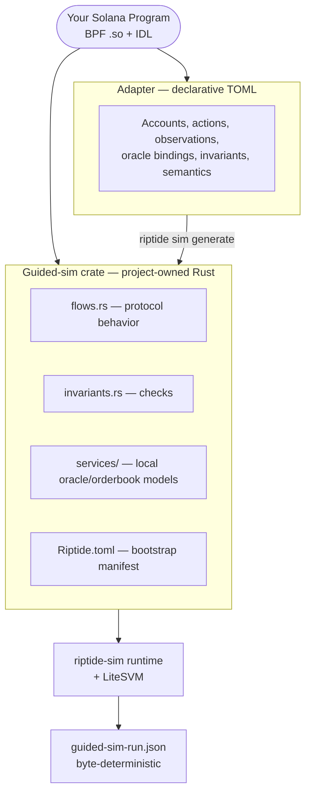

# Architecture

**Purpose:** How Riptide is assembled — the CLI, the project-owned
guided-sim crate, the `riptide-sim` runtime it builds against, and the
determinism model.

**Audience:** adapter authors, contributors, and reviewers who need to
understand Riptide's shape before reading code.

Riptide has two pieces:

- a **TypeScript CLI** (`cli/`) that scaffolds projects, validates
  inputs, generates the guided-sim crate, drives runs, and produces
  review and assessment artifacts; and
- a **Rust guided-sim runtime** (`riptide-sim/` + `riptide-sim-macros/`)
  that the generated, project-owned simulation crate builds against.

There is no separate engine binary. The simulation is ordinary Rust: a
crate Riptide generates into your repo at `.riptide/sim/`, compiled with
`cargo` and run against an in-process LiteSVM world. Everything
load-bearing is either declared in TOML on disk or written as
project-owned Rust you can read and edit.

## The two declarative-plus-code surfaces

A configured repo has two surfaces on top of your program:



1. **Adapter** — one TOML under `.riptide/adapters/` (shipping fixtures
   live under `fixtures/adapters/`) declaring your program, its accounts,
   actions, observations, oracle bindings, semantics, and invariants.
   Examples: `lending.toml`, `perpetuals.toml`, `amm.toml`,
   `liquid-staking.toml`, `stablecoin.toml`, `resource-grinder.toml`. The
   adapter is the wiring contract and the input to codegen.
2. **Guided-sim crate** — the Rust crate `riptide sim generate` scaffolds
   at `.riptide/sim/`. Generated `types.rs` (typed IDL builders) and
   `accounts.rs` (address storage) are regenerated code; `flows.rs`,
   `invariants.rs`, `types_ext.rs`, and `services/` are project-owned.
   This is where protocol behavior lives: dynamic `remaining_accounts`,
   multi-instruction transactions, target-vs-agent dispatch, and local
   oracle/orderbook/stake service models.

> **Economic semantics.** Versioned `[semantics]` blocks are authorable
> in the adapter today. The shipping lending, perps, AMM, liquid-staking,
> and stablecoin adapters declare `lending.v1`, `perps-margin.v1`,
> `amm.v1`, `lst.v1`, and `stablecoin.v1` role mappings with derived
> observations and expression invariants. Semantics add economic meaning
> on top of the raw field bindings; they do not change the runtime.

> **Skill-first setup, plain-file output.** The `riptide-config` skill is
> the default way to turn a thin `riptide init` scaffold into adapter TOML
> and a working guided-sim crate (flows, invariants, services, readiness
> notes) in one loop. `riptide-narrative` can summarize a completed run.
> Every artifact the skills generate is plain TOML, Rust, or JSON you can
> hand-author instead — see `fixtures/adapters/resource-grinder.toml` for
> a minimal from-scratch example.

## Codegen pipeline — adapter to crate

`riptide sim generate --adapter .riptide/adapters/<program>.toml` reads
the adapter and its IDL and writes the crate:

```text
.riptide/sim/
├── Cargo.toml
├── Riptide.toml
└── src/
    ├── main.rs
    ├── types.rs        — generated typed builders from the adapter IDL
    ├── accounts.rs     — generated address-storage fields
    ├── flows.rs        — project-owned protocol behavior
    ├── invariants.rs   — project-owned checks
    └── services/       — project-owned local service models
```

The crate depends on the `riptide-sim` runtime. From a Riptide source
checkout, the generator writes live path dependencies into the checkout,
so runtime changes are picked up without regenerating. From an installed
CLI, it copies the runtime crates into `.riptide/sim/vendor/` and writes
relative path dependencies, so the crate is self-contained: it builds
with only Rust and Cargo present, can be committed alongside your
program, and survives CLI upgrades.

`riptide sim refresh` replaces only the generated files (`types.rs`,
`accounts.rs`) after an IDL or account-list change, preserving the
project-owned files. See [guided simulations](guided-sim.md) for the
full ownership rules and the `Riptide.toml` schema.

## The `riptide-sim` runtime

The generated crate builds against `riptide-sim`, the Rust workspace
crate that provides the generic simulation substrate:

- **`World`** — the LiteSVM control surface guided code drives. It exposes
  `process_transaction` / `process_transaction_expect_success` /
  `process_transaction_expect_error`, raw `get_account` / `set_account` /
  `mutate_account`, Borsh read/write helpers, sysvar and clock controls
  (`set_clock`, `advance_clock`, slot/epoch/timestamp warps), and
  dependency-program loading. `svm()` / `svm_mut()` are the final escape
  hatch into LiteSVM directly.
- **Bootstrap** — applies the `Riptide.toml` manifest before
  `flows::init`: local dependency programs, base64 account snapshots, and
  explicit account-snapshot forks cached to disk (not a live validator
  fork).
- **Runner + RNG** — deterministic seed derivation, iteration/flow
  scheduling, labelled transaction outcomes, and the JSON artifact +
  `rerun.sh` writer.
- **Macros** (`riptide-sim-macros`) — `#[riptide_sim]` and `#[flow]`
  generate the dispatch glue around project-owned flow methods.

`riptide-sim` deliberately contains generic SVM mechanics only. Pyth,
Switchboard, OpenBook, Drift, Mango, Marinade, Whirlpool, and similar
protocol-specific account layouts are not in core — projects model those
in their own `services/` code through `World`.

## LiteSVM runtime — default, with honest caveats

Simulations run against **LiteSVM** (in-process SVM). LiteSVM removes the
RPC and confirmation overhead of `solana-test-validator`, so the same
program logic executes orders of magnitude faster end-to-end — both paths
run the same compiled BPF program.

What LiteSVM does not model: gossip, vote, PoH, full consensus behavior.
The speedup is infrastructure overhead removal, not a program-level
optimization. When validator-level parity matters, run your program
against `solana-test-validator` separately as the diagnostic reference
path. See [TOOLCHAIN.md](../TOOLCHAIN.md) for the pins both paths build
against.

## Determinism

Same seed in, same bytes out. `riptide sim run` derives per-iteration
seeds from a base seed and writes a byte-stable `guided-sim-run.json`:
base seed, per-iteration derived seeds, flow counts, labelled transaction
outcomes, compute units, expected-error counts, service-tick counts,
selected regression account hashes when configured, ordered flow-trace
metadata, and the retained failing seed. A `rerun.sh` script captures the
exact invocation.

Determinism is what makes a run re-derivable by an adversarial reviewer:
the adapter TOML, the committed guided-sim crate, `Riptide.toml`, and the
seed are the whole input. Nothing else is load-bearing. Reviewers
reproduce a run cold and compare the artifact.

## Input validation

The CLI reads the adapter TOML through Zod schemas
(`cli/src/schemas/adapter.ts`, `cli/src/compiler/schema.ts`) before
generating or refreshing the crate — this is the user-facing error
surface, tuned for readable messages. `riptide sim lint` then validates
the `Riptide.toml` manifest: local program/account paths, pubkeys,
base64 snapshots, duplicate bootstrap addresses, cached-snapshot pubkey
matches, and guarded metrics/regression/coverage declarations. Neither
step builds, fetches RPC accounts, or runs a simulation.

## The assessment flow

The end-to-end path is guided-sim first, then surface and assess:

```bash
riptide sim generate --adapter .riptide/adapters/<program>.toml
riptide sim run .riptide/sim --flows 20 --out .riptide/sim/artifacts/run-001
riptide sim surface .riptide/sim/artifacts/run-001 --sim .riptide/sim
riptide assess .riptide/sim
riptide review .riptide/sim/artifacts/run-001
```

- **`riptide sim run`** compiles and runs the crate and writes the
  guided-sim artifact.
- **`riptide sim surface`** reads the run plus the `[sim.sweep]` block in
  `Riptide.toml` and writes cartography artifacts (`risk-surface.json`,
  `campaign-summary.json`, `retention-manifest.json`) into the assess
  root, so `riptide assess` can render a risk-surface heatmap.
- **`riptide assess <guided-sim-root>`** is ingest-only: it reads an
  existing root and writes a byte-deterministic `assessment.json` +
  `assessment.md`. It does not run the simulation — run it first, then
  assess the root.

## Operator DX surfaces

Several commands share one mental model for first-run diagnosis before
any simulation runs:

- **`riptide doctor`** is a static health check. It probes the documented
  toolchain surface (`node`, `npm`, `rustc`, `cargo`, `solana`,
  `cargo-build-sbf`) via `execFile` without spawning a shell, and walks
  adapters under `<cwd>/.riptide/adapters/*.toml` and
  `<cwd>/fixtures/adapters/*.toml`. No build, no network, no simulation.
  Exit codes are `0` all-pass / `1` warnings-only / `2` at least one fail.
- **`riptide readiness`** inspects local protocol evidence readiness
  (adapter, guided-sim crate, artifacts) without building, fetching, or
  simulating.
- **`riptide sim lint <path>`** validates the guided-sim `Riptide.toml`
  manifest (see [Input validation](#input-validation)).
- **`riptide sim review <artifact-dir>`** and **`riptide review
  <path>`** read a guided-sim artifact cold, validate `rerun.sh` with
  `sh -n` without executing it, and emit reviewer markdown or `--json`
  with retained seed, flow counts, labelled transaction outcomes, the
  compact flow trace, failure reason, and rerun command.
- **`riptide sim debug <path> --seed <hex>`** reruns one seed with
  verbose labelled transaction logging.

These surfaces are **simulation evidence**, not audit signoff. A run
verdict describes the declared simulation run, not a security
attestation on the program.

## Further reading

- [`vision.md`](vision.md) — why this shape, what's in scope, what isn't.
- [`install.md`](install.md) — the installer, Docker, and repository build paths.
- [`guided-sim.md`](guided-sim.md) — when to use `.riptide/sim/`, the bootstrap manifest, and how to refresh generated builders safely.
- [`protocol-assessment.md`](protocol-assessment.md) — turning guided-sim evidence into a protocol-team assessment.
- [`../TOOLCHAIN.md`](../TOOLCHAIN.md) — the Rust / Solana CLI / SBF / Node pins the runtime and programs build against.
