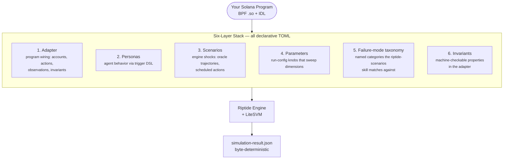

# Architecture

**Purpose:** How Riptide is assembled — the six-layer stack, the LiteSVM runtime, and the determinism model.

**Audience:** adapter authors, contributors, and reviewers who need to understand the engine's shape before reading code.

Riptide runs on two processes: a Rust engine (`engine/`) that drives the simulation, and a TypeScript CLI (`cli/`) that compiles personas, pre-validates inputs, orchestrates runs, and serves the dashboard. Every claim the engine makes is declared in TOML on disk, so nothing about a run is carried only in a binary.

## The six-layer stack

Each bundle layers six declarative surfaces on top of your program. All six live in files under `fixtures/`; none require editing engine code.

1. **Adapter** — one TOML under `fixtures/adapters/` declaring your program, its actions, its observations, and its invariants. Examples: `solend-fork.toml`, `perps-fork.toml`, `amm-fork.toml`, `resource-grinder.toml`.
2. **Personas** — TOML under `fixtures/personas/` describing agent behavior with a trigger DSL (`player.gold < 100 → craft`). Each bundle ships a persona library the scenarios skill can compose from.
3. **Scenarios** — engine shocks (oracle trajectories, scheduled actions) mounted from declarative presets. See `fixtures/scenarios/` and `engine/src/scenario/preset_spec.rs`.
4. **Parameters** — run-config knobs that sweep over the dimensions that matter: whale share, shock magnitude, trade size, leverage, depositor concentration.
5. **Failure-mode taxonomy** — categories like `whale_concentration`, `margin_cascade_from_oracle_shock`, `price_manipulation_via_swap`, `impermanent_loss_spike`. The `riptide-scenarios` skill matches your adapter's shape against this taxonomy.
6. **Invariants** — machine-checkable properties (`no_bad_debt`, `reserve_a > 0`, `k == reserve_a * reserve_b` within tolerance) declared inline in the adapter. The engine exits non-zero when any invariant fires, so invariants double as CI gates.

Three shipping bundles exercise every layer end-to-end: **lending** (Solend fork), **perps** (perps-lite), **AMM** (constant-product). A fourth generic bundle (`resource-grinder`) drives a non-DeFi SBF program end-to-end — if it runs, you can wire Riptide to your protocol.

> **Skills are optional accelerators, not requirements.** The `riptide-adapt`, `riptide-scenarios`, and `riptide-narrative` Claude Code skills produce first-pass TOML / run-configs / reports by letting a session-native LLM do the typing. Every artifact the skills generate is plain TOML or markdown you can hand-author instead — see `fixtures/adapters/resource-grinder.toml` for a minimal from-scratch example.

## LiteSVM runtime — default, with honest caveats

The engine's default backend is **LiteSVM** (in-process SVM). For the same `100 agents × 180 ticks` lending workload, LiteSVM completes in **0.898s** end-to-end; `solana-test-validator` with `--bpf-program` preload and warm caches takes **901.461s** (measured 2026-04-12, see `TOOLCHAIN.md`). That is roughly **~900x**, entirely from RPC and confirmation overhead removal — both paths execute the same `lending_pool.so` BPF program logic.

What LiteSVM does not model: gossip, vote, PoH, full consensus behavior. The speedup is infrastructure overhead removal, not a program-level optimization. When validator-level parity matters, the parity test at `engine/tests/lending_integration.rs` stays gated on `RIPTIDE_RUN_VALIDATOR_TESTS=1` as the diagnostic reference path. LiteSVM is the default runtime; the validator path is diagnostic only.

## Determinism

Same seed in, same bytes out, byte-for-byte, across the lending, perps, AMM, and generic bundles. The `e2e_determinism` integration test enforces this on every `cargo test -p riptide-engine` run by executing the same fixture twice and asserting the result JSON is byte-identical. Replay mode extends the same guarantee to historical trajectories — `riptide replay fixtures/replays/solend-nov-2022/config.json` reproduces the Solend June 2022 whale-risk incident and asserts a declared `no_bad_debt` invariant fires at the cascade tick.

Determinism is what makes the grid re-derivable by an adversarial reviewer: the adapter TOML + persona TOML + run-config + engine binary are the whole input. Nothing else is load-bearing.

## Adapter pipeline — TOML to engine

Inputs flow through two validators that share one mental model. The CLI reads adapter + persona + run-config TOML and runs them through Zod schemas (`cli/src/schemas/adapter.ts`, `cli/src/compiler/schema.ts`) before ever invoking the engine — this is the user-facing error surface, tuned for readable messages. The engine then deserializes the same shapes with serde. The two schemas mirror each other on purpose: the Zod layer catches shape errors fast in TypeScript with a friendly error; serde is the canonical truth at the Rust boundary. When they drift, serde wins and the CLI schema is the bug.

On a run, the CLI compiles personas, pre-validates adapter + run-config, then shells out to the release-build engine binary with the config, policies, and output paths. The engine loads the adapter, boots LiteSVM, deploys the pinned `.so` from `programs/<name>/target/deploy/`, ticks the scenario, and writes `simulation-result.json`. Invariants are evaluated at exit; any firing causes a non-zero exit. The dashboard reads the result JSON — the engine has no network surface of its own.

## Scenario discovery

`riptide run` with no positional argument discovers every scenario the current repo declares and executes them sequentially. The convention is `.riptide/scenarios/**/run-config.json` walked recursively from the CWD — every matching file is treated as a scenario, and the scenario name is the directory path relative to `.riptide/scenarios/` with `/` preserved as the grouping separator (so `.riptide/scenarios/hero-grid/w25-s40/run-config.json` becomes scenario name `hero-grid/w25-s40`, matching jest's `describe` nesting). Names are stable and sorted, so reruns produce identical scenario ordering regardless of filesystem traversal order.

Three invocation shapes share one command. `riptide run` runs everything discovered. `riptide run <pattern>` filters the discovered list by glob (`'*w25*'`, `'hero-grid/*'`). `riptide run <file-path>` runs a single run-config directly — the backward-compat path that scripts, CI, and the shipping fixtures still rely on; the file-existence check disambiguates it from a pattern. `riptide list` prints the discovered scenario list one per line, useful for CI integrations that want to know what will run before running it.

Per-scenario results and the aggregate summary land in `.riptide/last-run.json` (schema pinned in `cli/src/run/last-run.ts`); `riptide run --only-failing` reads that file to rerun only the scenarios that failed or aborted most recently. The convention pairs with `.riptide/adapters/` and `.riptide/personas/` so every artifact Riptide reads — adapter, personas, scenarios — lives under the same version-controlled tree in the user's own repo.

## Further reading

- [`vision.md`](vision.md) — why this shape, what's in scope, what isn't.
- [`install.md`](install.md) — the install, Docker, and from-source paths.
- [`../TOOLCHAIN.md`](../TOOLCHAIN.md) — the Rust / Solana CLI / SBF / Node pins the engine and programs build against.
