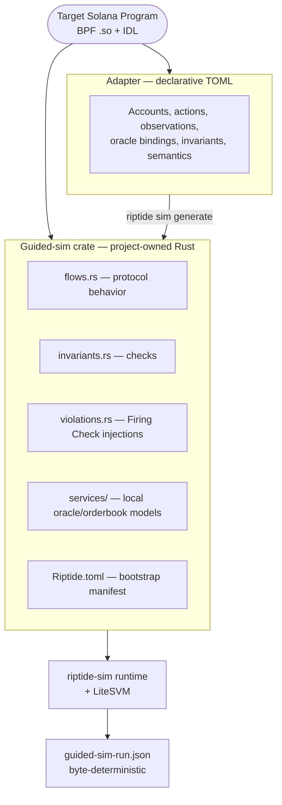

# Architecture

**Audience:** contributors to the Engine and the Skill. Users reach Riptide
only through the `/riptide-assess` Skill and never read this page.

Read these first; they are binding:

- [`CONTEXT.md`](../CONTEXT.md) — the domain glossary. Code, tests, docs and
  commit messages use its terms exactly.
- [ADR 0001 — the Skill is the only user surface](adr/0001-skill-is-the-only-user-surface.md):
  the Engine CLI is an API the Skill drives, with no human docs, prompts or
  banners.
- [ADR 0002 — deterministic Engine Output, agent-authored Assessment
  Context](adr/0002-deterministic-engine-output-vs-agent-context.md): Engine
  Output stays byte-pinned; everything the agent writes lives beside it.

The Engine has two pieces:

- a **TypeScript CLI** (`cli/`) that scaffolds the Workspace, validates
  inputs, generates the guided-sim crate, drives runs, renders Engine
  Output and gates the Skill's deliveries; and
- a **Rust guided-sim runtime** (`riptide-sim/` + `riptide-sim-macros/`)
  that the generated, project-owned simulation crate builds against.

There is no separate simulator binary. The simulation is ordinary Rust: a
crate the Engine generates into the user's repo at `.riptide/sim/`, compiled
with `cargo` and run against an in-process LiteSVM world. Everything
load-bearing is either declared in TOML on disk or written as project-owned
Rust, all of it Internal Artifacts the Skill authors.

## The two declarative-plus-code surfaces

A configured Workspace has two surfaces on top of the user's program:


```mermaid
flowchart TB
    P(["Target Solana Program<br>BPF .so + IDL"])

    subgraph Decl["Adapter — declarative TOML"]
        A["Accounts, actions, observations,<br>oracle bindings, invariants, semantics"]
    end

    subgraph Code["Guided-sim crate — project-owned Rust"]
        F["flows.rs — protocol behavior"]
        I["invariants.rs — checks"]
        V["violations.rs — Firing Check injections"]
        S["services/ — local oracle/orderbook models"]
        M["Riptide.toml — bootstrap manifest"]
    end

    P --> Decl
    P --> Code
    Decl -->|riptide sim generate| Code
    Code --> R["riptide-sim runtime<br>+ LiteSVM"]
    R --> O["guided-sim-run.json<br>byte-deterministic"]
```

1. **Adapter** — one TOML under `.riptide/adapters/` (shipping fixtures
   live under `fixtures/adapters/`) declaring the program, its accounts,
   actions, observations, oracle bindings, semantics, and invariants.
   Examples: `lending.toml`, `perpetuals.toml`, `amm.toml`,
   `liquid-staking.toml`, `stablecoin.toml`, `resource-grinder.toml`. The
   adapter is the wiring contract and the input to codegen.
2. **Guided-sim crate** — the Rust crate `riptide sim generate` scaffolds
   at `.riptide/sim/`. Generated `types.rs` (typed IDL builders) and
   `accounts.rs` (address storage) are regenerated code; `flows.rs`,
   `invariants.rs`, `violations.rs`, `types_ext.rs`, and `services/` are
   project-owned.
   This is where protocol behavior lives: dynamic `remaining_accounts`,
   multi-instruction transactions, target-vs-agent dispatch, and local
   oracle/orderbook/stake service models.

> **Economic semantics.** Versioned `[semantics]` blocks are authorable
> in the adapter today. The shipping lending, perps, AMM, liquid-staking,
> and stablecoin adapters declare `lending.v1`, `perps-margin.v1`,
> `amm.v1`, `lst.v1`, and `stablecoin.v1` role mappings with derived
> observations and expression invariants. Semantics add economic meaning
> on top of the raw field bindings; they do not change the runtime.

> **Skill-first setup, plain-file output.** The `/riptide-assess` Skill
> (`riptide-assess-skill/`) turns a thin `riptide init` scaffold into adapter
> TOML and a working guided-sim crate (flows, invariants, services) in its
> Setup and Repair stages, and writes the Causal Trace for each Breach in its
> Report stage. Every artifact the Skill generates is plain TOML, Rust, or
> JSON — see `fixtures/adapters/resource-grinder.toml` for
> a minimal from-scratch example.

## Codegen pipeline — adapter to crate

`riptide sim generate --adapter .riptide/adapters/<program>.toml` reads
the adapter and its IDL and writes the crate:

```text
.riptide/sim/
├── Cargo.toml
├── Riptide.toml
└── src/
    ├── main.rs
    ├── types.rs        — generated typed builders from the adapter IDL
    ├── accounts.rs     — generated address-storage fields
    ├── flows.rs        — project-owned protocol behavior
    ├── invariants.rs   — project-owned checks
    ├── violations.rs   — project-owned Firing Check violations
    └── services/       — project-owned local service models
```

The crate depends on the `riptide-sim` runtime. From a Riptide source
checkout, the generator writes live path dependencies into the checkout,
so runtime changes are picked up without regenerating. From an installed
CLI, it copies the runtime crates into `.riptide/sim/vendor/` and writes
relative path dependencies, so the crate is self-contained: it builds
with only Rust and Cargo present, can be committed alongside the
program, and survives Engine upgrades.

`riptide sim refresh` replaces only the generated files (`types.rs`,
`accounts.rs`) after an IDL or account-list change, preserving the
project-owned files. See [guided simulations](guided-sim.md) for the
full ownership rules and the `Riptide.toml` schema.

## The `riptide-sim` runtime

The generated crate builds against `riptide-sim`, the Rust workspace
crate that provides the generic simulation substrate:

- **`World`** — the LiteSVM control surface guided code drives. It exposes
  `process_transaction` / `process_transaction_expect_success` /
  `process_transaction_expect_error`, raw `get_account` / `set_account` /
  `mutate_account`, Borsh read/write helpers, sysvar and clock controls
  (`set_clock`, `advance_clock`, slot/epoch/timestamp warps), and
  dependency-program loading. `svm()` / `svm_mut()` are the final escape
  hatch into LiteSVM directly.
- **Bootstrap** — applies the `Riptide.toml` manifest before
  `flows::init`: local dependency programs, base64 account snapshots, and
  explicit account-snapshot forks cached to disk (not a live validator
  fork).
- **Runner + RNG** — deterministic seed derivation, iteration/flow
  scheduling, labelled transaction outcomes, and the JSON artifact +
  `rerun.sh` writer.
- **Macros** (`riptide-sim-macros`) — `#[riptide_sim]` and `#[flow]`
  generate the dispatch glue around project-owned flow methods.

`riptide-sim` deliberately contains generic SVM mechanics only. Pyth,
Switchboard, OpenBook, Drift, Mango, Marinade, Whirlpool, and similar
protocol-specific account layouts are not in core — projects model those
in their own `services/` code through `World`.

## LiteSVM runtime — default, with honest caveats

Simulations run against **LiteSVM** (in-process SVM). LiteSVM removes the
RPC and confirmation overhead of `solana-test-validator`, so the same
program logic executes orders of magnitude faster end-to-end — both paths
run the same compiled BPF program.

What LiteSVM does not model: gossip, vote, PoH, full consensus behavior.
The speedup is infrastructure overhead removal, not a program-level
optimization. When validator-level parity matters,
`solana-test-validator` is the separate diagnostic reference path. See [TOOLCHAIN.md](../TOOLCHAIN.md) for the pins both paths build
against.

## Determinism

Same seed in, same bytes out. `riptide sim run` derives per-iteration
seeds from a base seed and writes a byte-stable `guided-sim-run.json`:
base seed, per-iteration derived seeds, flow counts, labelled transaction
outcomes, compute units, expected-error counts, service-tick counts,
selected regression account hashes when configured, ordered flow-trace
metadata, and the retained failing seed. A `rerun.sh` script captures the
exact invocation.

Determinism is what makes a run re-derivable by an adversarial reviewer:
the adapter TOML, the committed guided-sim crate, `Riptide.toml`, and the
seed are the whole input. Nothing else is load-bearing. Reviewers
reproduce a run cold and compare the artifact.

## Input validation

The CLI reads the adapter TOML through Zod schemas
(`cli/src/schemas/adapter.ts`, `cli/src/compiler/schema.ts`) before
generating or refreshing the crate — this is the user-facing error
surface, and every message carries a `next` repair for the Skill.
`riptide sim lint` then validates
the `Riptide.toml` manifest: local program/account paths, pubkeys,
base64 snapshots, duplicate bootstrap addresses, cached-snapshot pubkey
matches, and guarded metrics/regression/coverage declarations. Neither
step builds, fetches RPC accounts, or runs a simulation.

## The assessment flow

The Skill's stages drive the Engine in this order (the full command list
and its JSON contract are in [Engine command contract](#engine-command-contract)):

| Stage | Engine commands | Output |
| --- | --- | --- |
| Setup | `init`, `readiness`, `sim generate`, `sim refresh`, `sim lint` | the Workspace, the adapter and the guided-sim crate |
| Run | `sim run` | `guided-sim-run.json` and `rerun.sh` |
| Firing Check | `sim run --firing-check` | which invariants fired |
| Repair | `sim debug`, `review` | the replay log of a failing seed |
| Surface | `sim surface` | `campaign-summary.json`, `risk-surface.json`, `retention-manifest.json` |
| Report | `assess`, `delta`, `validate` | Engine Output, the Delta, and the gate on the delivery |

`assess <guided-sim-root>` is ingest-only: it reads an existing root and
writes a byte-deterministic `assessment.json` + `assessment.md`. It never
runs the simulation.

## Diagnosis surfaces

Several commands let the Skill diagnose the Workspace before any
simulation runs:

- **`riptide readiness <path>`** inspects local protocol evidence
  readiness (adapter, guided-sim crate, artifacts) and runs the static
  health check for that repo. The health check probes the documented
  toolchain surface (`node`, `npm`, `rustc`, `cargo`, `solana`,
  `cargo-build-sbf`) via `execFile` without spawning a shell, and walks
  adapters under `<path>/.riptide/adapters/*.toml` and
  `<path>/fixtures/adapters/*.toml`. No build, no network, no simulation.
  A produced report exits `0` for a PASS or WARN health verdict and `2`
  when at least one check fails. A `--case-studies` corpus run has no
  health check.
- **`riptide sim lint <path>`** validates the guided-sim `Riptide.toml`
  manifest (see [Input validation](#input-validation)).
- **`riptide review [path]`** (default `.riptide/sim/artifacts`) reads a
  guided-sim artifact, campaign root or retained case cold, validate `rerun.sh` with
  `sh -n` without executing it, and emit reviewer markdown or `--json`
  with retained seed, flow counts, labelled transaction outcomes, the
  compact flow trace, failure reason, and rerun command.
- **`riptide sim debug <path> --seed <hex>`** reruns one seed with
  verbose labelled transaction logging.

These surfaces are **simulation evidence**, not audit signoff. A run
verdict describes the declared simulation run, not a security
attestation on the program.

## Engine command contract

The Engine CLI is an API the Skill drives (ADR 0001), so every command
runner follows one IO contract, defined in `cli/src/contract/`:

- **Injected streams.** A runner (`runReadiness`, `runInit`, `runSimRun`,
  ...) takes `stdoutWrite`, `stderrWrite` and `cwd` through its deps and
  never writes to the process directly. Relative paths resolve against
  the injected `cwd`. When streams are injected, a child process such as
  the sim crate's `cargo run` is piped through them instead of inheriting
  the terminal.
- **One envelope in `--json` mode.** The runner writes exactly one JSON
  document to stdout, and its exit code still signals the outcome.

  ```json
  { "schema_version": "riptide-command.v1", "command": "readiness", "ok": true, "data": { } }
  ```

- **One error shape.** A failure is the same envelope with `ok: false`
  and an `error` carrying a stable `code`, a one-line `message` and a
  `next` field naming the recommended next action. `data` may still
  carry the partial result when it helps the caller repair.

  ```json
  {
    "schema_version": "riptide-command.v1",
    "command": "readiness",
    "ok": false,
    "error": {
      "code": "health_checks_failed",
      "message": "1 health check failed: cargo-build-sbf",
      "next": "cargo-build-sbf: cargo-build-sbf ships with the Solana CLI — install or repair the Solana CLI"
    },
    "data": { }
  }
  ```

These commands are on the envelope. The Skill always passes `--json`; the
text output without it is a debugging aid for contributors.

- **`init`**: `data` lists the programs, the files created, each
  adapter and the scaffold warnings. Failures: `init_workspace_exists`,
  `init_no_program_detected`, `init_anchor_toml_unreadable`,
  `init_artifacts_unpaired`, `init_program_not_found`,
  `init_invalid_program_name`, `init_invalid_option`,
  `init_scaffold_failed`.
- **`readiness`**: `data` is the readiness report with the health report
  under `data.health` (or the case-study corpus, which has no health
  block). PASS and WARN health are a success envelope; a FAIL is
  `health_checks_failed` with the whole report still as `data`, and a
  health report that cannot be assembled is `health_report_failed`. Other
  failures: `readiness_missing_target`, `readiness_case_studies_not_found`,
  `readiness_failed`. The `readiness.json` that `--out` writes carries no
  health block.
- **`review`**: `data` is the
  guided-sim, campaign or retained-case review. Failures:
  `review_unrecognized_root`, `review_artifact_not_found`,
  `review_artifact_malformed`, `review_artifact_schema_invalid`,
  `review_trace_malformed`, `review_no_retained_cases`,
  `review_retained_path_missing`, `review_case_digest_invalid`,
  `review_rerun_script_missing`, `review_rerun_script_invalid`,
  `review_failed`.
- **`assess`**: `data` is the `assess-cli.v1` result. Failures:
  `assess_no_evidence`, `assess_input_not_found`, `assess_input_unreadable`,
  `assess_input_invalid`, `assess_artifact_unreadable`, `assess_artifact_malformed`,
  `assess_artifact_schema_mismatch`, `assess_artifacts_inconsistent`,
  `assess_surface_digest_mismatch`, `assess_honesty_gates_blocked` (with
  the gate report as `data.execution_honesty`), `assess_artifacts_drifted`,
  `assess_out_holds_assessment` (the `--out` directory already holds an
  `assessment-context.json`: an Assessment is never overwritten, so the
  rerun renders into a new directory beside it), `assess_failed`.
- **`delta <previous-dir> <current-dir>`**: the deterministic comparison of
  two Assessments of the same declared region, read from both Engine Outputs
  and Assessment Contexts. The region is the Depth plus the swept axes,
  bins, seed policy and run budget (a correctness Assessment's guided-sim
  iteration count). `data` is the `delta-cli.v1` result: both directories
  and digests, the region, and `data.delta`, which the Skill copies verbatim
  into the rerun's Assessment Context: `previous` (the earlier directory's
  name), `metric_moves` (every Engine Output figure and invariant outcome
  that changed, sorted by metric), `gaps_opened`, `gaps_closed` and
  `new_instructions` (each with whether it was exercised). Failures:
  `delta_same_assessment`, `delta_assessment_invalid` (with every problem
  as `data.problems`, including `delta_engine_output_unsupported`), `delta_region_mismatch` (with both regions),
  `delta_failed`.
- **`validate`**: the gate the Skill runs on whatever it delivers. It
  recognises the output from the one agent-written file in the directory
  and reads only. An **Assessment** (`assessment-context.json`, or Engine
  Output with no sidecar): `assessment.json` still matches its own
  `assessment_digest` (Engine Output is never edited),
  `assessment-context.json` is a valid `assessment-context.v1` Assessment
  Context (versions, Depth, Scope Declaration, Coverage, Gaps, family,
  invariants, Breaches and the Delta) with at least one exercised instruction and a Gap for every
  unexercised instruction and actor. Every Floor Invariant of the family is
  reported with `floor` provenance and no other invariant is; an invariant
  counts as `held` or `breached` only when its Firing Check `fired`, and one
  reported as a `gap` has a Gap. Every `breached` invariant has a Breach and
  every Breach names one; each carries its seed, the exact replay command
  against the pinned Engine (`npx --yes @riptide/cli@<engine_version> sim
  debug .riptide/sim --seed <seed>`) and a Causal Trace citing at least one
  tick as `T<n>` and one exercised instruction's transaction. The composed `assessment.md` opens with
  `## Scope Declaration`, `## Coverage`, `## Gaps`, `## Invariants` (naming
  every invariant) and `## Engine Output`, the last citing the digest; with a
  Breach, `## Breaches` sits between `## Invariants` and `## Engine Output`
  and gives every replay command. Assessments sit side by side under names
  that sort in the order they were written (`.riptide/assessments/001`,
  `002`, …). When an earlier one ran the same region, the Assessment Context
  carries the Delta `riptide delta` computes against the latest such
  Assessment, unedited, and `## Delta` sits after `## Invariants` and any
  `## Breaches`, before `## Engine Output`, naming it. An **Out-of-Scope Note** (`out-of-scope-note.json`,
  `out-of-scope-note.v1`: a `not-economic-protocol` verdict with evidence,
  its override and code-level auditing referrals) with an
  `out-of-scope-note.md` opening `## Classification`, `## Code-Level
  Auditing`. A **Blocker Report** (`blocker-report.json`, `blocker-report.v1`:
  Depth, Scope Declaration, the failed command, the unexercised instructions
  and actors, and a Gap for each) with a `blocker-report.md` opening
  `## Scope Declaration`, `## Blocker`, `## Gaps` that names every Gap.
  Neither short-circuit output may sit beside Engine Output or carry a
  risk-surface section (`Coverage`, `Engine Output`, `Region Coverage`,
  `Risk Surface`, `Invariants`, `Breaches`, `Delta`). `data` is the
  `validate-cli.v1` result, with the output as `data.kind`
  (`assessment`, `out-of-scope-note` or `blocker-report`); an Assessment's
  `data.delta_previous` names the Assessment its Delta compares against, or
  is `null` on the first one of a region. A failure's
  `error` is the first problem, `data.problems` lists them all and
  `data.kind` names the output when one was recognised. Failures:
  `validate_dir_not_found`, `validate_output_missing`,
  `validate_output_ambiguous`, `validate_engine_output_missing`,
  `validate_engine_output_modified`, `validate_engine_output_present`,
  `validate_context_missing`, `validate_context_malformed`,
  `validate_context_schema_unsupported`, `validate_context_schema_invalid`,
  `validate_coverage_zero`, `validate_gap_missing`,
  `validate_floor_invariant_missing`, `validate_invariant_provenance_mismatch`,
  `validate_invariant_not_fired`, `validate_breach_missing`,
  `validate_breach_invariant_mismatch`, `validate_breach_replay_missing`,
  `validate_breach_replay_unpinned`, `validate_breach_causal_trace_missing`,
  `validate_breach_causal_trace_uncited`, `validate_report_invariant_unlisted`,
  `validate_report_breach_unlisted`, `validate_delta_missing`,
  `validate_delta_previous_mismatch`, `validate_delta_mismatch`,
  `validate_report_delta_unlinked`,
  `validate_output_malformed`, `validate_output_schema_unsupported`,
  `validate_output_schema_invalid`, `validate_report_missing`,
  `validate_report_section_missing`, `validate_report_section_order`,
  `validate_report_engine_output_unlinked`, `validate_report_gap_unnamed`,
  `validate_report_risk_surface`, `validate_failed`.

- **`sim generate`**: `data` names the crate, adapter, IDL and manifests,
  and carries the `setup-gaps.json` report as `setup_gaps`.
  `data.floor_invariants` names the adapter's family (from
  `[semantics].class`; no class, or `token.v1`, is the generic fallback) and
  each of its Floor Invariants with the expression the sim checks and whether
  it is `wired`. The Floor Invariants live in `cli/src/sim/floor-invariants.ts`,
  one set per family, each reading only the derived observations the
  family's semantic class requires. `invariants.rs` checks every wired one
  the adapter does not already declare (an adapter invariant with a Floor
  Invariant's ID adapts it), and `violations.rs` declares a Firing Check for
  every one; an unwired Floor Invariant's check cannot be applied, so it
  reports `did-not-fire` until the adapter declares its class. A genesis with
  unresolved tick-0 seams in a freshly generated `src/flows.rs` is
  `sim_setup_gaps` (exit 2, with the same `data`); seams in a preserved
  `flows.rs` are not a failure. Failures: `sim_adapter_not_found`,
  `sim_adapter_invalid`, `sim_adapter_unsupported`, `sim_idl_invalid`,
  `sim_runtime_missing`, `sim_generate_failed`.
- **`sim refresh`**: `data` names the crate, adapter and IDL. Failures: the
  `sim generate` adapter and IDL codes, and `sim_refresh_failed`.
- **`sim lint`**: `data` is the lint report (verdict, exit code, findings).
  PASS and WARN are a success envelope; FAIL is `sim_lint_failed`, whose
  `next` is the first failing finding's hint, or `sim_lint_manifest_missing`
  when there is no `Riptide.toml`.
- **`sim run`** and **`sim debug`**: the crate is built, then run, so a
  compile error is told apart from a failing run. The crate's own output is
  captured, not streamed. `sim run`'s `data` names the crate, the `--out`
  directory, the sweep, a summary of `guided-sim-run.json` and any
  execution-honesty gate that would block at `assess`. `sim debug`'s `data`
  is the replay: the seed, `status` (`passed` or `failed`), the runner's
  failure and the verbose `log`; a failing seed is a successful replay.
  Failures: `sim_crate_not_found`, `sim_build_failed` (compiler output as
  `data.diagnostics`, cargo's exit code), `sim_run_failed` (the seed to
  replay as `data.failing_seed`), `sim_runner_failed` (the runner stopped
  before any iteration failed), `sim_cargo_unavailable`.
- **`sim run --firing-check`**: instead of the simulation, runs init and
  the flows on one seed, then, per invariant the sim's `#[violations]`
  method declares (`src/violations.rs`), injects its violation and runs the
  end-of-run check. `data.invariants` lists each invariant, the injected
  violation, `result` (`fired` or `did-not-fire`) and a `detail` when the
  runtime can say why it did not fire; `data.fired` and `data.did_not_fire`
  count them. It writes no run artifact and takes no `--out`. Failures:
  `sim_firing_check_undeclared` (no violations declared, exit 2),
  `sim_firing_check_failed` (the seed never reached the injection), plus
  the build and cargo codes of `sim run`.
- **`sim surface`**: `data` names the output directory, the campaign ID,
  the files written and the execution-honesty gate report. The files are
  byte-identical to the ones the human path writes. Failures:
  `sim_surface_run_not_found`, `sim_surface_run_malformed`,
  `sim_surface_sweep_missing`, `sim_surface_failed`.
- **`sim fork`**: `data` names the address, cluster, snapshot path and
  whether the cache was reused. Failures: `sim_fork_cache_invalid`,
  `sim_fork_fetch_failed`, `sim_fork_account_not_found`, `sim_fork_failed`.

## Further reading

- [`../CONTEXT.md`](../CONTEXT.md) — the domain glossary.
- [`adr/`](adr/) — the accepted architecture decisions.
- [`guided-sim.md`](guided-sim.md) — the guided-sim crate, its bootstrap
  manifest, run artifacts and generated-file ownership.
- [`../riptide-assess-skill/skill/SKILL.md`](../riptide-assess-skill/skill/SKILL.md)
  — the Skill that drives the Engine.
- [`../TOOLCHAIN.md`](../TOOLCHAIN.md) — the Rust / Solana CLI / SBF / Node
  pins the runtime and programs build against.
- [`../CONTRIBUTING.md`](../CONTRIBUTING.md) — development setup, tests and
  releasing.
